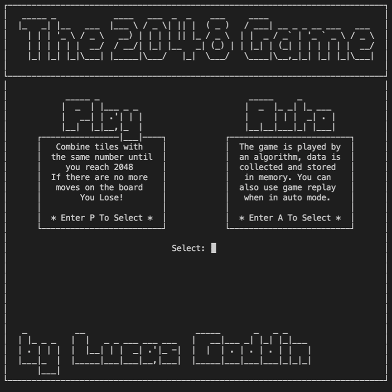
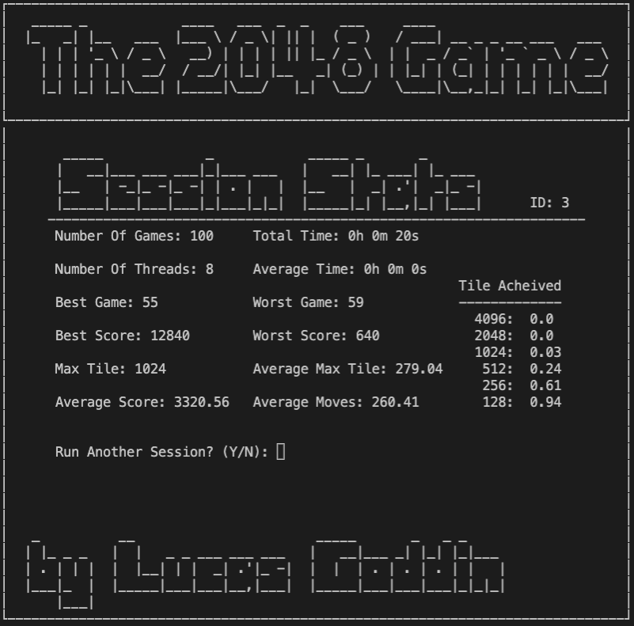
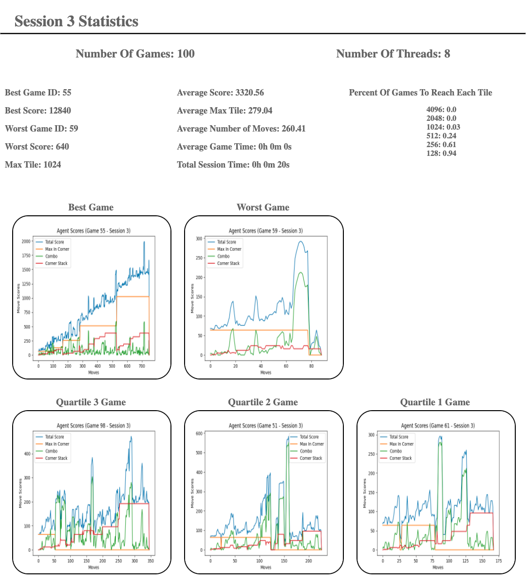

# Terminal 2048
The objective of the game is to create the 2048 tile by combining tiles with the same number.
The tiles are multiples of 2, every turn a new tile is generated.  

## Status  
Under Development  

## Motivation
I created this project to learn more about algorithms. My first goal was to create the game and recording system. Then I used these tools to experiment with different ways of playing using an algorithm or agent.

## User Experience
2048 Gameplay
<br>


In Game Statistics Screen
<br>


Saved HTML Statistics Report
<br>



## Features
* Standard user play mode
* Automated gameplay mode
* Multithreaded automated gameplay
* Generate HTML statistics reports for sessions of automated games
* Replay automated games
* Graphing of algorithm decision making for specific games


## Controls
* Menus
    * Use the options to navigate
    * Only enter one letter at a time then press enter
    * Use q to exit from any feature to the most recent menu.

* Game
    * Use w, a, s, d as arrow keys to move up, left, down and right accordingly
    * Only type one letter per move and press enter to make the move
    * Use q to exit from game to the main menu

## Installation
Use the package manager [pip](https://pip.pypa.io/en/stable/) to install dependencies found in requirements.txt.
Follow the instructions below to set up your virtual enviornment:

1. Create the virtual environment using python3's venv command
    >$python3 -m venv /example/path/destination/.env
    - Make sure to include /venv at the end in order to package the environment in a single directory

2. Navigate to the directory containing /.env
    >$cd /example/path/destination
3. Activate the virtual environment by calling the 'activate' script
    Mac/Linux:

    >$source .env/bin/activate

    Windows:

    >C:\\..\destination> .env\\bin\\activate.bat

4. Install dependencies using the included requirements file
    >$pip install -r requirements.txt  

Next create a config file, config.json. This file only needs to contain a path for recordings to be saved.

Example config.json:

```json
{
    "recording_path": "/Users/bobsmith/Documents/pythonProjects/2048Recording"
}
```

## Dependencies Used
Terminal 2048 is built with
* Pandas
* Matplotlib
* Colorama 
* Jinja 2

## Credits
Original 2048 game devloped by Gabriele Cirulli
* [Official Website](https://play2048.co/)
* [2048 Source Code On Github](https://github.com/gabrielecirulli/2048)

## Author
Lucas Goddin

